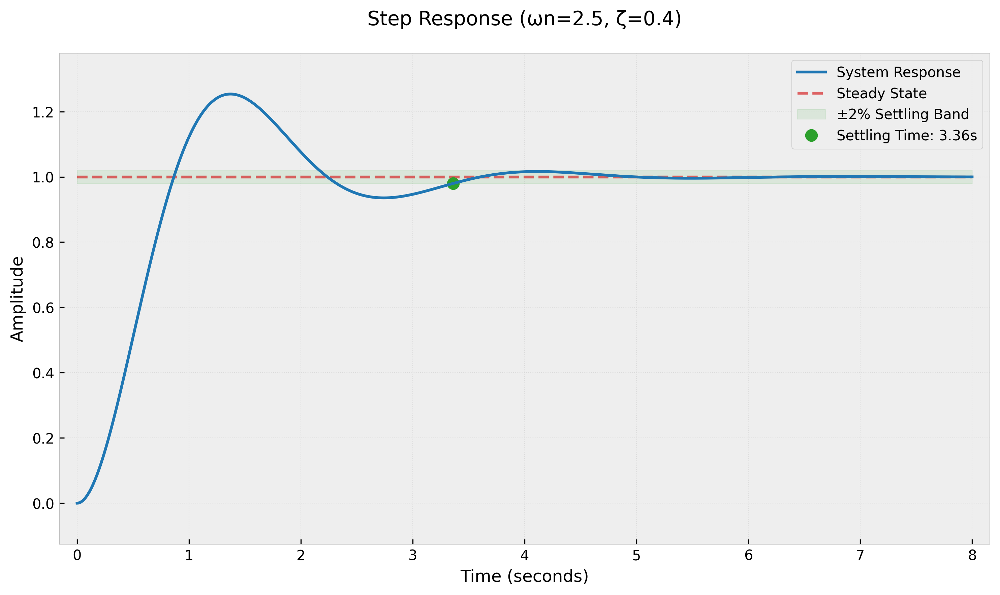
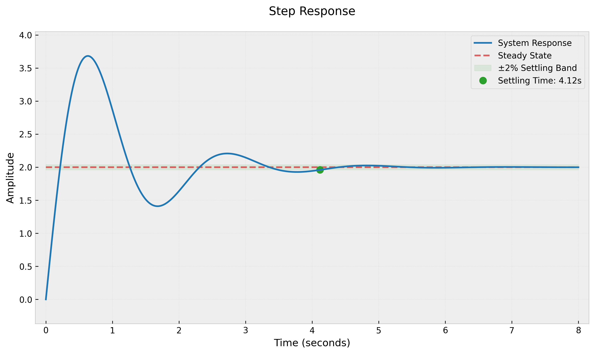

# Control System Step Response

A Python tool for plotting and analyzing step responses of control systems.

## Theory

### Second-Order System
A second-order system is described by the transfer function:

$$ G(s) = \frac{\omega_n^2}{s^2 + 2\zeta\omega_n s + \omega_n^2} $$

where:
- $\omega_n$ is the natural frequency
- $\zeta$ is the damping ratio

The system characteristics depend on $\zeta$:
- Underdamped: $0 < \zeta < 1$
- Critically damped: $\zeta = 1$
- Overdamped: $\zeta > 1$

### Settling Time
The settling time is calculated when the response remains within ±2% of the steady-state value:

$$ |y(t) - y_{ss}| \leq 0.02y_{ss} $$

where:
- $y(t)$ is the system response
- $y_{ss}$ is the steady-state value

### Complex Transfer Function
The example complex system uses the transfer function:

$$ G(s) = \frac{10(s + 2)}{s^2 + 2s + 10} = \frac{10s + 20}{s^2 + 2s + 10} $$

## Features

- Plot step responses of transfer functions
- Automatic settling time detection
- 2% settling band visualization
- High-quality plot export

## Example Plots

### Second-Order System

- Natural frequency ($\omega_n$) = 2.5
- Damping ratio ($\zeta$) = 0.4
- Shows underdamped response with overshoot

### Complex Transfer Function

- Transfer function: $G(s) = \frac{10(s + 2)}{s^2 + 2s + 10}$
- Demonstrates more complex dynamics

## Installation

1. Create a virtual environment:
```bash
python -m venv .venv
source .venv/bin/activate  # On Windows use: .venv\Scripts\activate
```

2. Install required packages:
```bash
pip install numpy matplotlib control
```

## Usage

```python
from control import TransferFunction
from second_order_system import plot_elegant_response

# Create a transfer function
num = [10, 20]  # Numerator coefficients: 10s + 20
den = [1, 2, 10]  # Denominator coefficients: s² + 2s + 10
sys = TransferFunction(num, den)

# Plot the response
plot_elegant_response(sys, t_max=8, title="Step Response")
```

## Implementation Details

### Settling Time Detection
The code uses a windowed approach to find the settling time:
```python
def find_settling_band(t, y, steady_state, tolerance=0.02):
    error = np.abs(y - steady_state)
    settling_threshold = steady_state * tolerance
    
    # Find where response enters and stays within the band
    within_band = error <= settling_threshold
    
    # Use windowed check to ensure it stays within band
    window_size = 100
    for i in range(len(within_band) - window_size):
        if all(within_band[i:i+window_size]):
            return t[i], y[i]
```

This ensures the response has truly settled by checking if it stays within the band for a sustained period.

## Project Structure

```
.
├── README.md
├── second_order_system.py
├── .gitignore
└── plots/
    ├── elegant_response.png
    ├── elegant_complex_response.png
```
