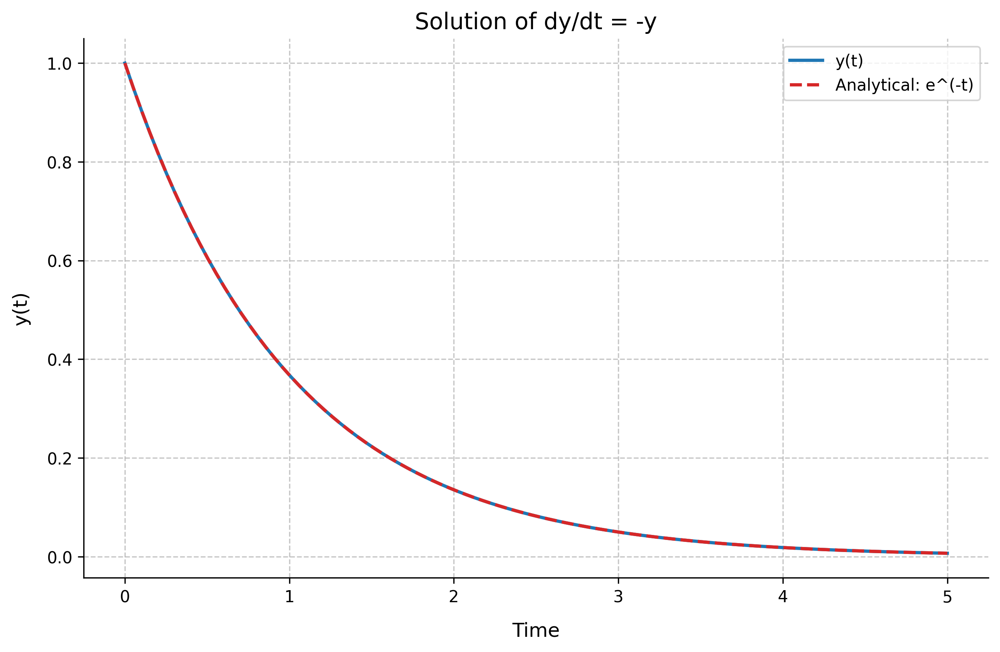
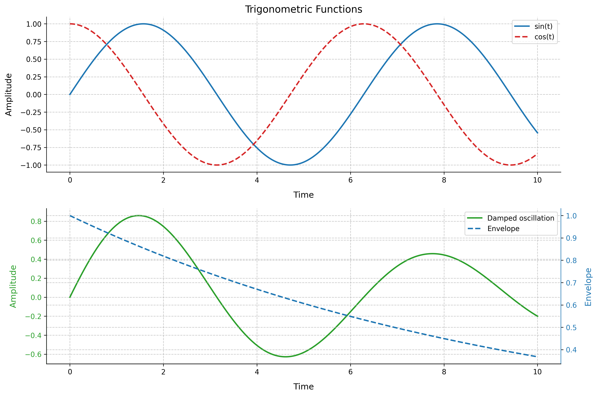
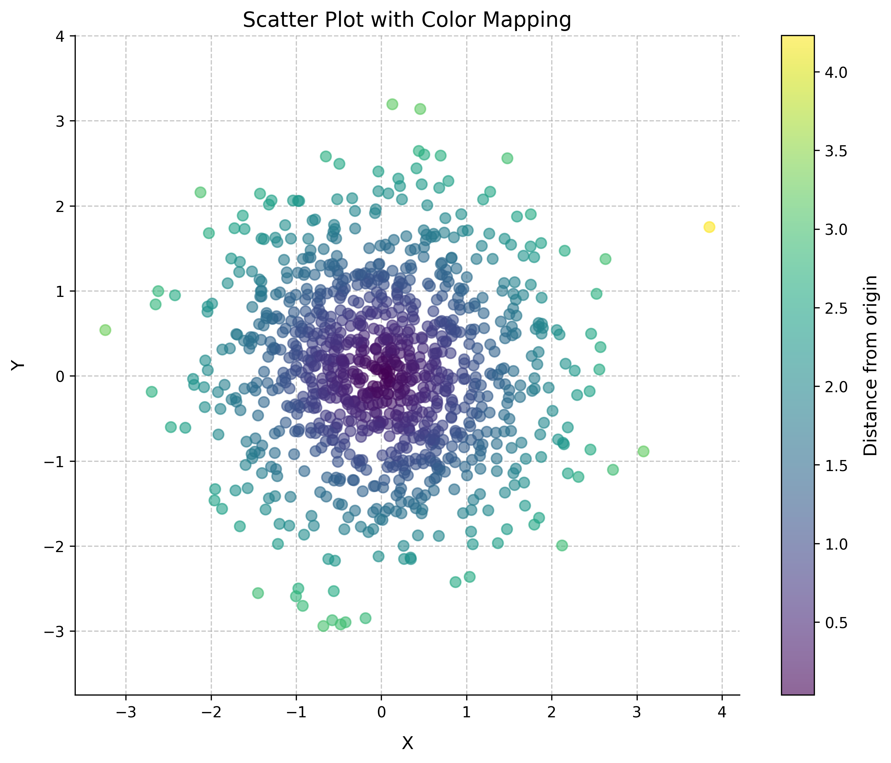
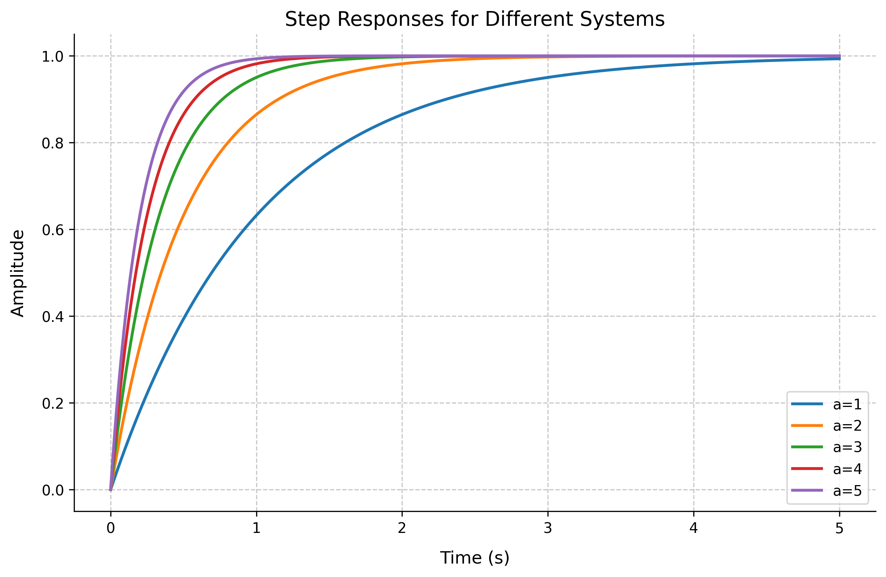

# Control System Design with Python

## Introduction to Control Systems Engineering

Control systems engineering is a crucial field that deals with the analysis and design of systems that maintain desired behaviors through feedback mechanisms. Python provides powerful tools for control system analysis and design.

!!! info "Key Python Libraries"
    The following libraries are essential for control systems engineering:
    
    * `numpy` - Numerical computations
        * Efficient array operations
        * Linear algebra functions
        * Mathematical functions
    * `control` - Control systems analysis
        * Transfer function creation and manipulation
        * System analysis tools
        * Control design methods
    * `matplotlib` - Data visualization
        * 2D and 3D plotting
        * Multiple plot types
        * Customizable visualizations
    * `sympy` - Symbolic mathematics
        * Symbolic calculations
        * Equation solving
        * Laplace transforms
    * `scipy` - Scientific computing
        * Differential equation solvers
        * Optimization tools
        * Signal processing functions

## Python Fundamentals for Control Systems

### Basic Python Concepts

!!! note "Python Syntax Overview"
    Python's clean and readable syntax makes it ideal for engineering applications:
    
    ```python
    # Basic variable assignments
    x = 123.3
    text = "Some text"
    flag = True
    print(f"x = {x}, text = {text}, flag = {flag}")
    
    # Lists (similar to arrays in other languages)
    x = [1, 2, 3, 4]
    print("List x:", x)
    ```
    
    Output:
    ```
    x = 123.3, text = Some text, flag = True
    List x: [1, 2, 3, 4]
    ```

### NumPy for Numerical Computations

!!! tip "NumPy Arrays and Operations"
    NumPy provides efficient array operations essential for control systems:
    
    ```python
    import numpy as np
    
    # Creating arrays
    x = np.array([1, 2, 3, 4])
    print("NumPy array x:", x)
    
    # Arrays of zeros and ones
    x = np.zeros(4)
    y = np.ones((2, 2))
    print("Array of zeros:", x)
    print("2x2 array of ones:\n", y)
    
    # Array operations
    a = np.array([1, 2, 3])
    b = np.array([4, 5, 6])
    print("\nArray operations:")
    print("a + b =", a + b)
    print("a * b =", a * b)
    print("a dot b =", np.dot(a, b))
    ```
    
    Output:
    ```
    NumPy array x: [1 2 3 4]
    Array of zeros: [0. 0. 0. 0.]
    2x2 array of ones:
     [[1. 1.]
      [1. 1.]]
    
    Array operations:
    a + b = [5 7 9]
    a * b = [ 4 10 18]
    a dot b = 32
    ```

### Symbolic Mathematics with SymPy

Let's start with basic symbolic operations using a quadratic expression:

Consider the quadratic expression:

\[
f(x) = x^2 + 2x + 1
\]

In standard form:

\[
ax^2 + bx + c \text{ where } a=1, b=2, c=1
\]

Complete square form:

\[
(x + 1)^2
\]

Root:

\[
x = -1 \text{ (single root)}
\]

!!! example "Basic Symbolic Operations"
    ```python
    import sympy as sp
    
    # Define symbolic variable
    x = sp.Symbol('x')
    
    # Create and manipulate expressions
    expr = x**2 + 2*x + 1
    print("Original expression:", expr)
    
    # Solve equation
    eq = sp.Eq(expr, 0)
    solution = sp.solve(eq, x)
    print("\nSolving x^2 + 2x + 1 = 0:")
    print("x =", solution)
    ```
    
    Output:
    ```
    Original expression: x**2 + 2*x + 1
    
    Solving x^2 + 2x + 1 = 0:
    x = [-1]
    ```

For the function:

\[
f(x) = x^2 + 2x + 1
\]

The derivative is:

\[
\frac{d}{dx}f(x) = 2x + 2
\]

The integral is:

\[
\int f(x)dx = \frac{x^3}{3} + x^2 + x + C
\]

!!! example "Calculus Operations"
    ```python
    # Perform calculus operations
    derivative = sp.diff(expr, x)
    integral = sp.integrate(expr, x)
    
    print("Derivative:", derivative)
    print("Integral:", integral)
    ```
    
    Output:
    ```
    Derivative: 2*x + 2
    Integral: x**3/3 + x**2 + x
    ```

Consider the time function:

\[
f(t) = t^2e^{-t}
\]

The Laplace transform is:

\[
\mathcal{L}\{t^2e^{-t}\} = \frac{2}{(s+1)^3}
\]

!!! example "Laplace Transforms"
    ```python
    # Define time and complex frequency variables
    t = sp.Symbol('t')
    s = sp.Symbol('s')
    
    # Define time function and compute Laplace transform
    f_t = t**2 * sp.exp(-t)
    F_s = sp.laplace_transform(f_t, t, s)
    
    print("Time function:", f_t)
    print("Laplace transform:", F_s[0])
    ```
    
    Output:
    ```
    Time function: t**2*exp(-t)
    Laplace transform: 2/(s + 1)**3
    ```

Consider the matrix:

\[
M = \begin{bmatrix} 1 & 2 \\ 3 & 4 \end{bmatrix}
\]

Properties:

1. Determinant:

\[
det(M) = (1 \cdot 4) - (2 \cdot 3) = -2
\]

2. Inverse:

First, compute the adjugate matrix divided by determinant:

\[
M^{-1} = \frac{1}{det(M)}\begin{bmatrix} 4 & -2 \\ -3 & 1 \end{bmatrix}
\]

Which simplifies to:

\[
M^{-1} = \begin{bmatrix} -2 & 1 \\ \frac{3}{2} & -\frac{1}{2} \end{bmatrix}
\]

!!! example "Matrix Operations"
    ```python
    # Create and manipulate matrices
    M = sp.Matrix([[1, 2], [3, 4]])
    
    print("Matrix M:")
    print(M)
    print("\nDeterminant:", M.det())
    print("\nInverse:")
    print(M.inv())
    ```
    
    Output:
    ```
    Matrix M:
    Matrix([[1, 2], [3, 4]])
    
    Determinant: -2
    
    Inverse:
    Matrix([[-2, 1], [3/2, -1/2]])
    ```

### Differential Equations with SciPy

Control systems often involve differential equations. Here's how to solve them:

Consider the first-order differential equation:

\[
\frac{dy}{dt} = -y
\]

With initial condition:

\[
y(0) = 1
\]

The analytical solution is:

\[
y(t) = e^{-t}
\]

!!! info "Solving ODEs"
    ```python
    import numpy as np
    from scipy.integrate import odeint
    import matplotlib.pyplot as plt
    
    # Define the differential equation dy/dt = -y
    def model(y, t):
        return -y
    
    # Time points and initial condition
    t = np.linspace(0, 5, 100)
    y0 = 1
    
    # Solve ODE
    solution = odeint(model, y0, t)
    
    # Plot results
    plt.figure(figsize=(10, 6))
    plt.plot(t, solution, 'b-', label='y(t)')
    plt.plot(t, np.exp(-t), 'r--', label='Analytical: e^(-t)')
    plt.grid(True)
    plt.xlabel('Time')
    plt.ylabel('y(t)')
    plt.title('Solution of dy/dt = -y')
    plt.legend()
    plt.show()
    
    # Print solution values
    print("Solution values at t = [0, 1, 2, 3, 4, 5]:")
    t_points = [0, 1, 2, 3, 4, 5]
    y_points = np.interp(t_points, t, solution.flatten())
    for t_val, y_val in zip(t_points, y_points):
        print(f"t = {t_val:.1f}, y = {y_val:.4f}")
    ```
    
    Output:
    ```
    Solution values at t = [0, 1, 2, 3, 4, 5]:
    t = 0.0, y = 1.0000
    t = 1.0, y = 0.3680
    t = 2.0, y = 0.1354
    t = 3.0, y = 0.0498
    t = 4.0, y = 0.0183
    t = 5.0, y = 0.0067
    ```
    
    {: .responsive-image}

## Advanced Plotting Techniques

### Multiple Plots and Subplots

!!! tip "Creating Complex Plots"
    Control system analysis often requires multiple plots:
    
    ```python
    import numpy as np
    import matplotlib.pyplot as plt
    
    # Generate data
    t = np.linspace(0, 10, 1000)
    f1 = np.sin(t)
    f2 = np.cos(t)
    f3 = np.exp(-0.1*t)*np.sin(t)
    
    # Create figure with subplots
    fig, (ax1, ax2) = plt.subplots(2, 1, figsize=(12, 8))
    
    # First subplot: Multiple functions
    ax1.plot(t, f1, 'b-', label='sin(t)')
    ax1.plot(t, f2, 'r--', label='cos(t)')
    ax1.grid(True)
    ax1.set_xlabel('Time')
    ax1.set_ylabel('Amplitude')
    ax1.set_title('Trigonometric Functions')
    ax1.legend()
    ```
    
    {: .responsive-image}

### Data Visualization with Scatter Plots

!!! example "Scatter Plot with Color Mapping"
    Visualize relationships between variables:
    
    ```python
    import numpy as np
    import matplotlib.pyplot as plt
    
    # Generate random data
    np.random.seed(42)
    x = np.random.normal(0, 1, 1000)
    y = np.random.normal(0, 1, 1000)
    z = np.sqrt(x**2 + y**2)
    
    # Create scatter plot
    plt.figure(figsize=(10, 8))
    scatter = plt.scatter(x, y, c=z, cmap='viridis', 
                         s=50, alpha=0.5)
    plt.colorbar(scatter, label='Distance from origin')
    plt.grid(True)
    plt.xlabel('X')
    plt.ylabel('Y')
    plt.title('Scatter Plot with Color Mapping')
    plt.axis('equal')
    plt.show()
    ```
    
    {: .responsive-image}

## Control Systems with Python Control

### Transfer Functions and Step Response

!!! info "Basic Control System Analysis"
    The `control` library provides essential tools:
    
    <div class="center" markdown>
    
    Consider the transfer function:
    
    $$
    G(s) = \frac{s + 2}{s^2 + 2s + 1}
    $$
    
    </div>
    
    ```python
    import control
    import numpy as np
    import matplotlib.pyplot as plt
    
    # Create a transfer function G(s) = (s + 2)/(s^2 + 2s + 1)
    s = control.TransferFunction.s
    G = control.TransferFunction([1, 2], [1, 2, 1])
    
    # Generate and plot step response
    t, y = control.step_response(G)
    plt.figure(figsize=(10, 6))
    plt.plot(t, y, linewidth=2)
    plt.grid(True)
    plt.title('Step Response')
    plt.xlabel('Time (s)')
    plt.ylabel('Amplitude')
    plt.show()
    ```
    
    {: .responsive-image}

### Multiple System Responses

!!! example "Comparing Different Systems"
    Compare responses of different transfer functions:
    
    <div class="center" markdown>
    
    $$
    \text{For different values of } a\text{, consider: }
    G(s) = \frac{a}{s + a}
    $$
    
    </div>
    
    ```python
    # Create multiple transfer functions
    plt.figure(figsize=(10, 6))
    t = np.linspace(0, 5, 500)
    
    for a in range(1, 6):
        G = control.TransferFunction([a], [1, a])
        t, y = control.step_response(G, t)
        plt.plot(t, y, linewidth=2, label=f'a={a}')
    
    plt.grid(True)
    plt.xlabel('Time (s)')
    plt.ylabel('Amplitude')
    plt.title('Step Responses for Different Systems')
    plt.legend(loc='lower right')
    plt.show()
    ```
    
    {: .responsive-image}

!!! tip "Best Practices"
    When working with control systems in Python:
    
    1. Always use descriptive variable names
    2. Include proper axis labels and titles
    3. Add legends when plotting multiple curves
    4. Use appropriate time scales for system responses
    5. Document transfer functions and system parameters
    6. Include grid lines for better readability
    7. Save high-resolution figures for documentation
