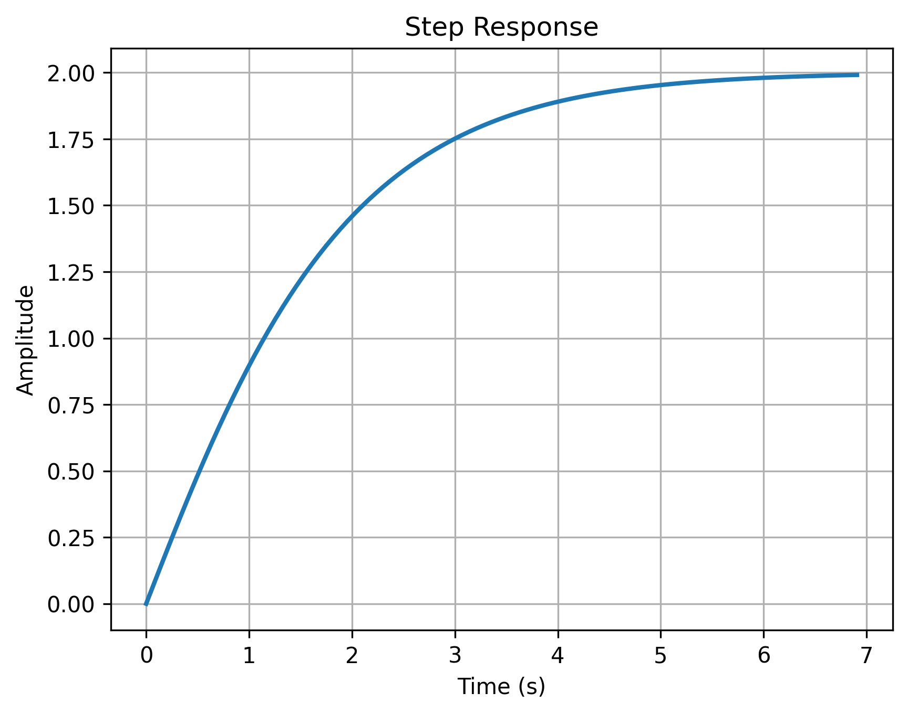
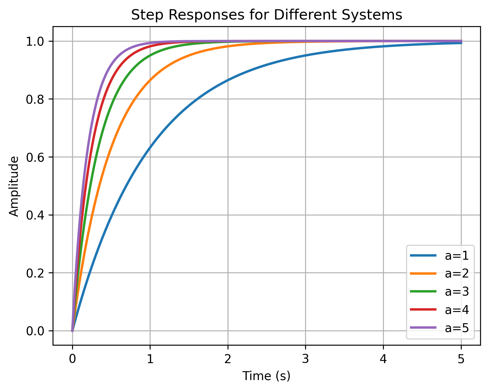

# Control System Design with Python

### Introduction to Python for Control Systems

Python is a versatile programming language that's excellent for control systems engineering. We'll use several key libraries:
- `numpy` for numerical computations
- `control` for control systems analysis
- `matplotlib` for plotting

### Basic Python Concepts

Python's syntax is clean and readable. Here are some basic examples:

```python
# Basic variable assignments
x = 123.3
text = "Some text"
flag = True
print(f"x = {x}, text = {text}, flag = {flag}")

# Lists (similar to arrays in other languages)
x = [1, 2, 3, 4]
print("List x:", x)

# Using NumPy for numerical arrays
import numpy as np
x = np.array([1, 2, 3, 4])
print("NumPy array x:", x)

# Creating arrays of zeros and ones
x = np.zeros(4)
y = np.ones((2, 2))
print("Array of zeros:", x)
print("2x2 array of ones:\n", y)
```
```
Output:
x = 123.3, text = Some text, flag = True
List x: [1, 2, 3, 4]
NumPy array x: [1 2 3 4]
Array of zeros: [0. 0. 0. 0.]
2x2 array of ones:
 [[1. 1.]
  [1. 1.]]
```

### Functions in Python

Functions are defined using the `def` keyword:

```python
def square(x):
    return x * x

x = 2
y = square(x)
print(f"The square of {x} is {y}")

# Let's try with a list of numbers
numbers = [1, 2, 3, 4]
squares = [square(n) for n in numbers]
print(f"The squares of {numbers} are {squares}")
```
```
Output:
The square of 2 is 4
The squares of [1, 2, 3, 4] are [1, 4, 9, 16]
```

### Control Systems with Python Control

The `control` library provides powerful tools for control systems analysis. Let's look at some basic examples:

#### Single Step Response
Here's how to create a transfer function and plot its step response:

```python
import control
import numpy as np
import matplotlib.pyplot as plt

# Create a transfer function G(s) = (s + 2)/(s^2 + 2s + 1)
s = control.TransferFunction.s
G = control.TransferFunction([1, 2], [1, 2, 1])

# Print transfer function
print("Transfer function G(s):")
print(G)

# Generate and plot step response
t, y = control.step_response(G)
plt.figure()  # Using default size
plt.plot(t, y, linewidth=2)
plt.grid(True)
plt.title('Step Response')
plt.xlabel('Time (s)')
plt.ylabel('Amplitude')
plt.show()
```
```
Output:
Transfer function G(s):
       s + 2
-------------------
s^2 + 2 s + 1
```

<p align="center">
  
</p>

#### Multiple Step Responses
We can also compare step responses of different systems:

```python
import control
import numpy as np
import matplotlib.pyplot as plt

# Create figure
plt.figure()  # Using default size
t = np.linspace(0, 5, 500)

# Generate step responses for different systems
for a in range(1, 6):
    # Create transfer function G(s) = a/(s + a)
    G = control.TransferFunction([a], [1, a])
    print(f"\nTransfer function for a={a}:")
    print(G)
    
    # Get and plot step response
    t, y = control.step_response(G, t)
    plt.plot(t, y, linewidth=2, label=f'a={a}')

plt.grid(True)
plt.xlabel('Time (s)')
plt.ylabel('Amplitude')
plt.title('Step Responses for Different Systems')
plt.legend(loc='lower right')
plt.show()
```
```
Output:
Transfer function for a=1:
  1
-----
s + 1

Transfer function for a=2:
  2
-----
s + 2

Transfer function for a=3:
  3
-----
s + 3

Transfer function for a=4:
  4
-----
s + 4

Transfer function for a=5:
  5
-----
s + 5
```

<p align="center">
  
</p>

This example shows how to:
1. Create transfer functions with different parameters
2. Generate step responses
3. Plot multiple responses on the same graph
4. Add proper labels and legends

The Python ecosystem provides these powerful tools for control systems analysis, making it an excellent choice for control system design and analysis.
