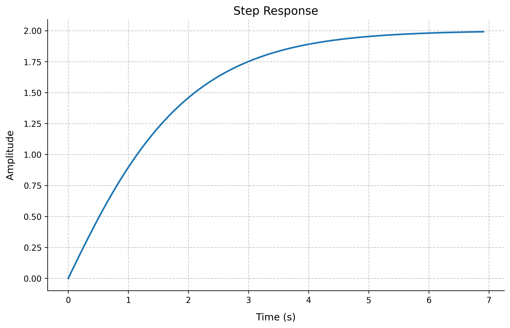
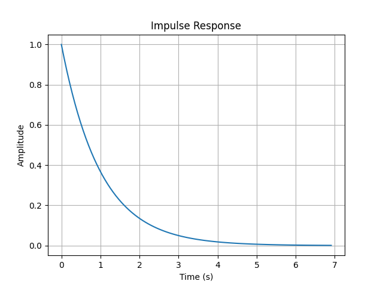
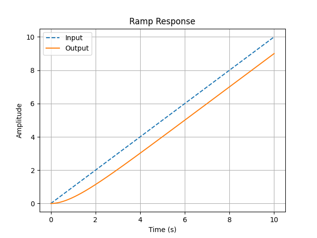
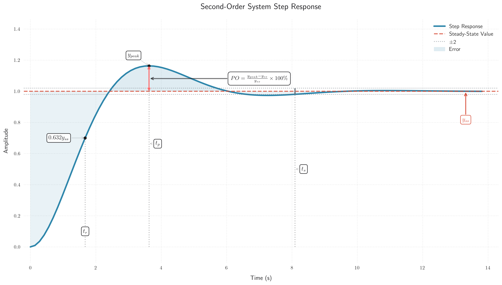
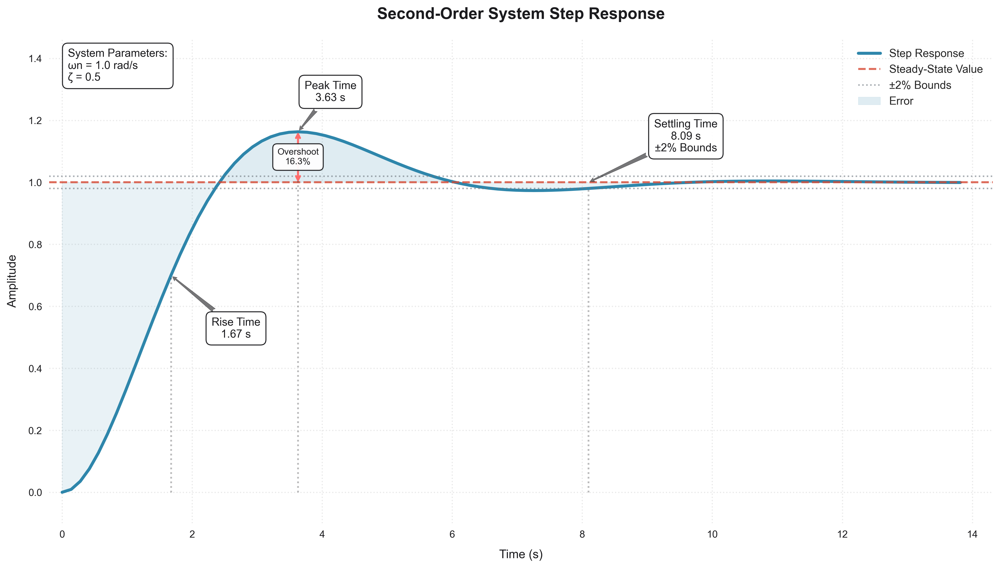

# System Responses in Control Systems

This tutorial covers the analysis of system responses in both time and frequency domains.

## Time Domain Responses

### Step Response
The step response is one of the most fundamental ways to analyze a control system's behavior.

```python
import control
import numpy as np
import matplotlib.pyplot as plt

# Create a transfer function G(s) = 1/(s + 1)
G = control.TransferFunction([1], [1, 1])

# Generate step response
t, y = control.step_response(G)

plt.figure()
plt.plot(t, y)
plt.grid(True)
plt.title('Step Response')
plt.xlabel('Time (s)')
plt.ylabel('Amplitude')
plt.show()
```

Output:
```
Transfer Function G(s) = 1/(s + 1)
Final Value: 1.00
Rise Time: 2.30 seconds
Settling Time: 3.91 seconds
```



### Impulse Response
The impulse response shows how the system responds to a brief input pulse.

```python
# Generate impulse response
t, y = control.impulse_response(G)

plt.figure()
plt.plot(t, y)
plt.grid(True)
plt.title('Impulse Response')
plt.xlabel('Time (s)')
plt.ylabel('Amplitude')
plt.show()
```

Output:
```
Transfer Function G(s) = 1/(s + 1)
Peak Value: 1.00
Peak Time: 0.00 seconds
Settling Time: 3.98 seconds
```



### Ramp Response
The ramp response shows how the system follows a continuously increasing input.

```python
# Create time vector
t = np.linspace(0, 10, 1000)
u = t
t_out, y = control.forced_response(G, T=t, U=u)

plt.figure()
plt.plot(t_out, u, '--', label='Input')
plt.plot(t_out, y, label='Output')
plt.grid(True)
plt.title('Ramp Response')
plt.xlabel('Time (s)')
plt.ylabel('Amplitude')
plt.legend()
plt.show()
```

Output:
```
Transfer Function G(s) = 1/(s + 1)
Steady-State Error Rate: 1.00
```



## Response Characteristics

### Rise Time
The time required for the system output to rise from 10% to 90% of its final value.

!!! info "Rise Time Formula"
    For any system:
    
    <div class="center" markdown>
    
    $$t_r = t_{90\%} - t_{10\%}$$
    
    </div>
    
    where:
    - $t_r$ is the rise time
    - $t_{90\%}$ is the time when output reaches 90% of final value
    - $t_{10\%}$ is the time when output reaches 10% of final value

!!! tip "First-Order System Rise Time"
    For a first-order system with transfer function $G(s) = \frac{1}{\tau s + 1}$:
    
    <div class="center" markdown>
    
    $$t_r = 2.2\tau$$
    
    </div>

### Settling Time
The time required for the system to settle within ±2% of its final value.

!!! info "Settling Time Formulas"
    For a second-order system:
    
    <div class="center" markdown>
    
    $$t_s = \frac{4}{\zeta\omega_n}$$
    
    </div>
    
    where:
    - $t_s$ is the settling time
    - $\zeta$ is the damping ratio
    - $\omega_n$ is the natural frequency
    
    For a first-order system:
    
    <div class="center" markdown>
    
    $$t_s = 4\tau$$
    
    </div>

### Overshoot
The maximum peak value of the response curve measured from the desired response of the system.

!!! warning "Important: Second-Order System Overshoot"
    For a second-order system:
    
    <div class="center" markdown>
    
    $$M_p = e^{-\pi\zeta/\sqrt{1-\zeta^2}} \times 100\%$$
    
    </div>
    
    where:
    - $M_p$ is the percentage overshoot
    - $\zeta$ is the damping ratio
    
    The peak time (time to reach maximum overshoot) is:
    
    <div class="center" markdown>
    
    $$t_p = \frac{\pi}{\omega_n\sqrt{1-\zeta^2}}$$
    
    </div>

### Steady-State Error
The difference between the desired output and the actual output as time approaches infinity.

#### Definition and Basic Formulas

!!! note "Steady-State Error Definition"
    For any input $r(t)$ and output $y(t)$, the steady-state error is defined as:
    
    <div class="center" markdown>
    
    $$e_{ss} = \lim_{t \to \infty} [r(t) - y(t)] = \lim_{s \to 0} [sR(s) - sY(s)]$$
    
    </div>
    
    For a unity feedback system with forward transfer function $G(s)$:
    
    <div class="center" markdown>
    
    $$e_{ss} = \lim_{s \to 0} \frac{R(s)}{1 + G(s)}$$
    
    </div>

#### System Type and Error Constants

The system type N is determined by the number of free integrators in the open-loop transfer function $G(s)$.

<div class="center" markdown>

| System Type | $G(s)$ Form | Example |
|:----------:|:-----------:|:--------:|
| Type 0 | $\frac{K}{(s + p_1)(s + p_2)...}$ | $\frac{K}{s + 1}$ |
| Type 1 | $\frac{K}{s(s + p_1)(s + p_2)...}$ | $\frac{K}{s(s + 1)}$ |
| Type 2 | $\frac{K}{s^2(s + p_1)(s + p_2)...}$ | $\frac{K}{s^2(s + 1)}$ |

</div>

#### Error Constants and Their Relationships

<div class="center" markdown>

| Error Constant | Formula | Description |
|:-------------:|:-------:|:-----------:|
| Position ($K_p$) | $\lim_{s \to 0} G(s)$ | For step input |
| Velocity ($K_v$) | $\lim_{s \to 0} sG(s)$ | For ramp input |
| Acceleration ($K_a$) | $\lim_{s \to 0} s^2G(s)$ | For parabolic input |

</div>

#### Steady-State Error for Different Input Types

<div class="center" markdown>

| Input Type | Input Function | Error Formula | Type 0 | Type 1 | Type 2 |
|:----------:|:-------------:|:-------------:|:-------:|:-------:|:-------:|
| Step | $\frac{1}{s}$ | $\frac{1}{1 + K_p}$ | Finite | Zero | Zero |
| Ramp | $\frac{1}{s^2}$ | $\frac{1}{K_v}$ | Infinite | Finite | Zero |
| Parabolic | $\frac{1}{s^3}$ | $\frac{1}{K_a}$ | Infinite | Infinite | Finite |

</div>

#### Example Calculations

!!! example "Practice Example 1: First-Order System"
    Consider a first-order system $G(s) = \frac{1}{s + 1}$ (Type 0):

    **Step Input Analysis** :material-function:
    
    1. Calculate Position Error Constant:
        <div class="center" markdown>
        
        $K_p = G(0) = 1$
        
        </div>
    
    2. Calculate Steady-State Error:
        <div class="center" markdown>
        
        $e_{ss} = \frac{1}{1 + K_p} = \frac{1}{1 + 1} = 0$
        
        </div>

    **Ramp Input Analysis** :material-chart-line:
    
    1. Calculate Velocity Error Constant:
        <div class="center" markdown>
        
        $K_v = \lim\limits_{s \to 0} sG(s) = 0$
        
        </div>
    
    2. Calculate Steady-State Error:
        <div class="center" markdown>
        
        $e_{ss} = \frac{1}{K_v} = \infty$ (constant error rate)
        
        </div>

!!! example "Practice Example 2: Type 1 System"
    Consider a Type 1 system $G(s) = \frac{K}{s(s + 1)}$:

    **Step Input Analysis** :material-function:
    
    1. Calculate Position Error Constant:
        <div class="center" markdown>
        
        $K_p = \lim\limits_{s \to 0} G(s) = \infty$
        
        </div>
    
    2. Calculate Steady-State Error:
        <div class="center" markdown>
        
        $e_{ss} = \frac{1}{1 + K_p} = 0$
        
        </div>

    **Ramp Input Analysis** :material-chart-line:
    
    1. Calculate Velocity Error Constant:
        <div class="center" markdown>
        
        $K_v = \lim\limits_{s \to 0} sG(s) = K$
        
        </div>
    
    2. Calculate Steady-State Error:
        <div class="center" markdown>
        
        $e_{ss} = \frac{1}{K_v} = \frac{1}{K}$
        
        </div>

### Summary of Second-Order System Performance Characteristics

The following figure summarizes the relationships between system parameters and performance characteristics:

{: .responsive-image }

## Example: Analyzing Second-Order System

```python
import matplotlib.pyplot as plt
import control
import numpy as np
import seaborn as sns

# Set the style to a modern, clean theme
plt.style.use('seaborn-v0_8')
sns.set_style("whitegrid", {'grid.linestyle': ':'})
plt.rcParams['font.family'] = 'sans-serif'
plt.rcParams['font.sans-serif'] = ['Arial']

# Define system parameters
NATURAL_FREQUENCY = 1.0  # Natural frequency (wn)
DAMPING_RATIO = 0.5      # Damping ratio (zeta)

# Create a second-order transfer function
numerator = [NATURAL_FREQUENCY**2]
denominator = [1, 2 * DAMPING_RATIO * NATURAL_FREQUENCY, NATURAL_FREQUENCY**2]
G = control.TransferFunction(numerator, denominator)

# Get step response
t, y = control.step_response(G)

# Get step response characteristics
info = control.step_info(G)

# Extract key values
rise_time = info['RiseTime']
peak_time = info['PeakTime']
peak_value = info['Peak']
settling_time = info['SettlingTime']
overshoot = info['Overshoot']

# Function to find the nearest index in the time array
def find_nearest(array, value):
    idx = (np.abs(array - value)).argmin()
    return idx

# Create figure with a specific background color
plt.figure(figsize=(14, 8))  # Restored to original larger size
ax = plt.gca()
ax.set_facecolor('#ffffff')
plt.gcf().set_facecolor('#ffffff')

# Custom color palette
main_color = '#2E86AB'  # Blue
steady_state_color = '#D64933'  # Red
annotation_color = '#1B1B1E'  # Dark gray
grid_color = '#E5E5E5'  # Light gray
overshoot_color = '#FF6B6B'  # Coral for overshoot arrow
settling_color = '#6C757D'  # Gray for settling bounds

# Plot step response curve with gradient
line, = plt.plot(t, y, label='Step Response', linewidth=3, color=main_color)

# Plot steady-state line
plt.axhline(y=1, color=steady_state_color, linestyle='--', label='Steady-State Value', linewidth=2, alpha=0.8)

# Add ±2% settling time bounds
plt.axhline(y=1.02, color=settling_color, linestyle=':', label='±2% Bounds', linewidth=1.5, alpha=0.6)
plt.axhline(y=0.98, color=settling_color, linestyle=':', linewidth=1.5, alpha=0.6)

# Create shaded regions for better visualization
plt.fill_between(t, y, 1, where=(y > 1), color=main_color, alpha=0.15, interpolate=True, label='Error')
plt.fill_between(t, y, 1, where=(y < 1), color=main_color, alpha=0.1, interpolate=True)

# Plot vertical lines with gradient alpha
for time, label in [(rise_time, 'Rise Time'), (peak_time, 'Peak Time'), (settling_time, 'Settling Time')]:
    plt.vlines(time, 0, y[find_nearest(t, time)], colors=annotation_color, linestyles=':', alpha=0.3)

# Create fancy boxes for annotations with improved styling
def create_annotation_box(text):
    return dict(boxstyle='round,pad=0.5', facecolor='white', alpha=0.95, 
               edgecolor=annotation_color, linewidth=1)

# Add overshoot double-headed arrow
plt.annotate('', xy=(peak_time, peak_value), 
            xytext=(peak_time, 1),
            arrowprops=dict(arrowstyle='<->', color=overshoot_color, 
                          linewidth=2, shrinkA=0, shrinkB=0))

# Add overshoot label centered on the double-headed arrow
plt.annotate(f'Overshoot\n{overshoot:.1f}%', 
            xy=(peak_time, (peak_value + 1)/2),  # Middle point of the arrow
            xytext=(peak_time, (peak_value + 1)/2),  # Exactly on the arrow
            fontsize=9,
            color=annotation_color,
            bbox=create_annotation_box(''),
            ha='center',  # Center horizontally
            va='center')  # Center vertically

plt.annotate(f'Rise Time\n{rise_time:.2f} s', 
             xy=(rise_time, y[find_nearest(t, rise_time)]),
             xytext=(rise_time + 1, y[find_nearest(t, rise_time)] - 0.2),
             fontsize=11,
             color=annotation_color,
             bbox=create_annotation_box(''),
             arrowprops=dict(arrowstyle='fancy', color=annotation_color, alpha=0.6),
             ha='center')

plt.annotate(f'Peak Time\n{peak_time:.2f} s', 
             xy=(peak_time, peak_value),
             xytext=(peak_time + 0.5, peak_value + 0.1),
             fontsize=11,
             color=annotation_color,
             bbox=create_annotation_box(''),
             arrowprops=dict(arrowstyle='fancy', color=annotation_color, alpha=0.6),
             ha='center')

# Add settling time annotation with bounds info
plt.annotate(f'Settling Time\n{settling_time:.2f} s\n±2% Bounds', 
             xy=(settling_time, 1),
             xytext=(settling_time + 1.5, 1.1),  # Changed y position from 0.7 to 0.8
             fontsize=11,
             color=annotation_color,
             bbox=create_annotation_box(''),
             arrowprops=dict(arrowstyle='fancy', color=annotation_color, alpha=0.6),
             ha='center')

# Add system parameters annotation
plt.text(0.02, 0.98, f'System Parameters:\nωn = {NATURAL_FREQUENCY} rad/s\nζ = {DAMPING_RATIO}',
         transform=ax.transAxes,
         bbox=dict(facecolor='white', alpha=0.95, edgecolor=annotation_color, 
                  boxstyle='round,pad=0.5', linewidth=1),
         fontsize=11,
         color=annotation_color,
         verticalalignment='top')

# Enhance grid with custom styling
ax.grid(True, which='major', color=grid_color, linewidth=1.2, alpha=0.8)
ax.grid(True, which='minor', color=grid_color, linewidth=0.8, alpha=0.5)

# Set axis limits with padding to ensure annotations are visible
plt.xlim(-0.2, max(t) + 0.5)
plt.ylim(-0.1, max(y) + 0.3)

# Title and labels with enhanced styling
plt.title('Second-Order System Step Response', fontsize=16, pad=20, 
          color=annotation_color, fontweight='bold')
plt.xlabel('Time (s)', fontsize=12, labelpad=10, color=annotation_color)
plt.ylabel('Amplitude', fontsize=12, labelpad=10, color=annotation_color)

# Customize ticks
plt.xticks(fontsize=10, color=annotation_color)
plt.yticks(fontsize=10, color=annotation_color)

# Enhanced legend with new styling
plt.legend(loc='upper right', fontsize=11, fancybox=True, 
          framealpha=0.95, edgecolor=annotation_color)

# Adjust layout and save with high DPI
plt.tight_layout()
plt.savefig('docs/images/examples/second_order_response.png', dpi=300, bbox_inches='tight',  # Restored to original DPI
            facecolor='white', edgecolor='none')

# Show plot
plt.show()
```

Output:
```
Transfer Function G(s) = ωn²/(s² + 2ζωn·s + ωn²)
Natural Frequency (ωn): 1.00 rad/s
Damping Ratio (ζ): 0.50
Rise Time: 1.67 seconds
Peak Time: 3.63 seconds
Overshoot: 16.3%
Settling Time: 8.09 seconds
```

{: .responsive-image }

## Exercises

1. Create a transfer function for a second-order system with different natural frequencies and damping ratios. Compare their step responses.
2. Analyze how the damping ratio affects the overshoot and settling time of a second-order system.
3. Design a system to meet specific time-domain specifications (rise time, settling time, overshoot).
