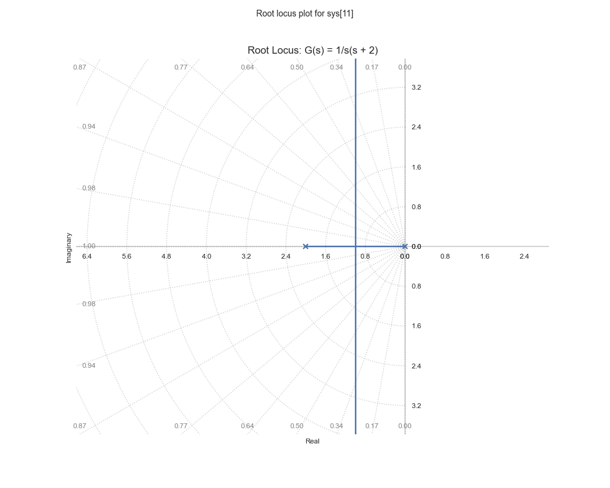
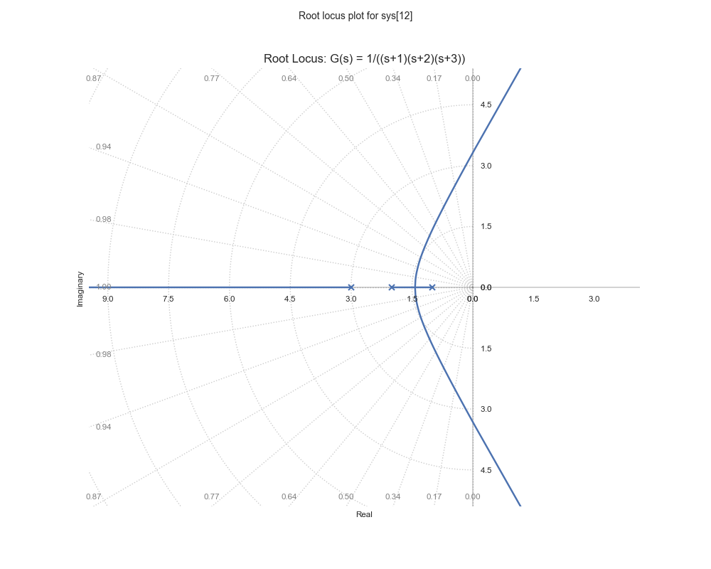

# Root Locus Analysis

The root locus is a graphical method for analyzing how the poles of a closed-loop system change as a system parameter (usually the gain) varies.

## Understanding Root Locus

The root locus shows the paths that the poles of the closed-loop system follow as the gain K varies from 0 to ∞. For a system with forward transfer function G(s) and unity feedback:

$$
T(s) = \frac{KG(s)}{1 + KG(s)}
$$

## Basic Rules for Sketching Root Locus

1. The root locus starts at the open-loop poles (K = 0)
2. The root locus ends at the open-loop zeros (K = ∞)
3. The number of branches equals the number of open-loop poles
4. Branches approach asymptotes at high gains
5. The root locus is symmetric about the real axis

## Example 1: Simple Second-Order System

```python
import control
import numpy as np
import matplotlib.pyplot as plt

# Create transfer function G(s) = 1/(s(s + 2))
num = [1]
den = [1, 2, 0]  # s^2 + 2s
G = control.TransferFunction(num, den)

# Generate root locus
plt.figure(figsize=(10, 8))
control.root_locus(G)
plt.title('Root Locus: G(s) = 1/s(s + 2)')
plt.grid(True)
plt.show()
```



## Example 2: System with Multiple Poles

```python
# Create transfer function G(s) = 1/((s+1)(s+2)(s+3))
G = control.TransferFunction([1], [1, 6, 11, 6])

# Generate root locus
plt.figure(figsize=(10, 8))
control.root_locus(G)
plt.title('Root Locus: G(s) = 1/((s+1)(s+2)(s+3))')
plt.grid(True)
plt.show()
```



## Analyzing Root Locus Features

### Break-Away Points
Points where branches of the root locus depart from the real axis.

```python
# Function to find break-away points
def find_breakaway_points(G):
    # Get denominator coefficients
    den = G.den[0][0]
    # Calculate derivative of characteristic equation
    # Implementation details...
    pass
```

### Crossing Points
Points where the root locus crosses the imaginary axis, indicating stability boundaries.

For our simple second-order system:
- The root locus crosses the imaginary axis at approximately ±j1.4
- This occurs at a gain value of K ≈ 2.0

## Design Example: Lead Compensator

```python
# Design a lead compensator
alpha = 10
T = 1
num_c = [T, 1]
den_c = [T/alpha, 1]
C = control.TransferFunction(num_c, den_c)

# Combined system
GC = control.series(G, C)

# Plot root locus of compensated system
plt.figure(figsize=(10, 8))
control.root_locus(GC)
plt.title('Root Locus with Lead Compensator')
plt.grid(True)
plt.show()
```

## Stability Analysis Using Root Locus

### Gain Selection
The root locus helps in selecting appropriate gain values for stability:

```python
# Find gain for specific closed-loop poles
desired_poles = [-1 + 1j, -1 - 1j]
K = control.root_locus_plot(G, plot=False)
```

### Stability Margins
Analyzing stability margins from root locus:

```python
# Calculate gain and phase margins
gm, pm, _, _ = control.margin(G)
print(f"Gain Margin: {gm} dB")
print(f"Phase Margin: {pm} degrees")
```

## Exercises

1. Plot the root locus for a system with transfer function G(s) = K/(s² + 2s + 2).
2. Find the range of K for which the system is stable.
3. Design a compensator to achieve specific closed-loop pole locations.
4. Analyze how zeros affect the root locus shape and system stability.
