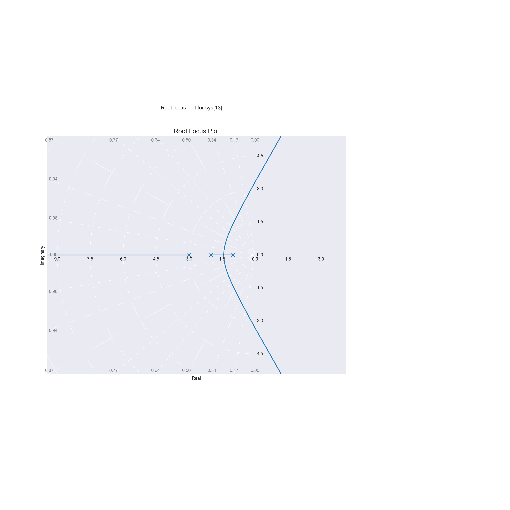

# Control System Design - Week 1

## Root Locus Plot

An example transfer function is given:

$$
G(s) = \frac{1}{(s+1)(s+2)(s+3)}
$$

Using Python's control library:

```python
import control
import numpy as np
import matplotlib.pyplot as plt

# Create transfer function G(s) = 1/((s+1)(s+2)(s+3))
G = control.TransferFunction([1], [1, 6, 11, 6])

# Generate root locus plot
plt.figure()
control.root_locus(G)
plt.title('Root Locus Plot')
plt.grid(True)
plt.show()
```

<p align="center">

</p>

## Bode Plot for a Band-Pass Filter

Given the band-pass filter:

$$
G(s) = \frac{1}{Q w_0^2} \frac{1}{s^2 + \frac{w_0}{Q} s + w_0^2}
$$

Using Python:

```python
import control
import numpy as np
import matplotlib.pyplot as plt

# Define parameters
f0 = 100  # Center frequency in Hz
df = 10   # Bandwidth in Hz
w0 = 2 * np.pi * f0
fl = f0 - df
fh = f0 + df
Q = f0 / (fh - fl)

# Create transfer function
num = [w0**2 / Q]
den = [1, w0/Q, w0**2]
system = control.TransferFunction(num, den)

# Generate Bode plot
plt.figure(figsize=(8, 12))
control.bode_plot(system, dB=True)
plt.show()
```

<p align="center">

</p>

## Impulse, Step, and Ramp Responses

For a given transfer function:

$$
G(s) = \frac{1}{s+1}
$$

Calculate the impulse, step, and ramp responses:

```python
from scipy.signal import lti, step, impulse
import numpy as np
import matplotlib.pyplot as plt

# Define transfer function G(s) = 1/(s+1)
num = [1]
den = [1, 1]
system = lti(num, den)

# Time vector
t = np.linspace(0, 10, 500)

# Get responses
t_step, y_step = step(system, T=t)
t_impulse, y_impulse = impulse(system, T=t)
ramp_input = t
_, y_ramp, _ = system.output(ramp_input, T=t)

# Plot responses
plt.figure(figsize=(10, 12))

plt.subplot(3, 1, 1)
plt.plot(t_impulse, y_impulse, label='Impulse Response')
plt.grid(True)
plt.xlabel('Time (s)')
plt.ylabel('Amplitude')
plt.title('Impulse Response')

plt.subplot(3, 1, 2)
plt.plot(t_step, y_step, label='Step Response', color='green')
plt.grid(True)
plt.xlabel('Time (s)')
plt.ylabel('Amplitude')
plt.title('Step Response')

plt.subplot(3, 1, 3)
plt.plot(t, y_ramp, label='Ramp Response', color='red')
plt.grid(True)
plt.xlabel('Time (s)')
plt.ylabel('Amplitude')
plt.title('Ramp Response')

plt.tight_layout()
plt.show()
```

<p align="center">

</p>
